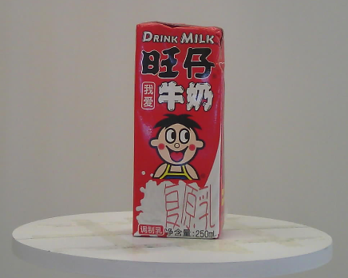
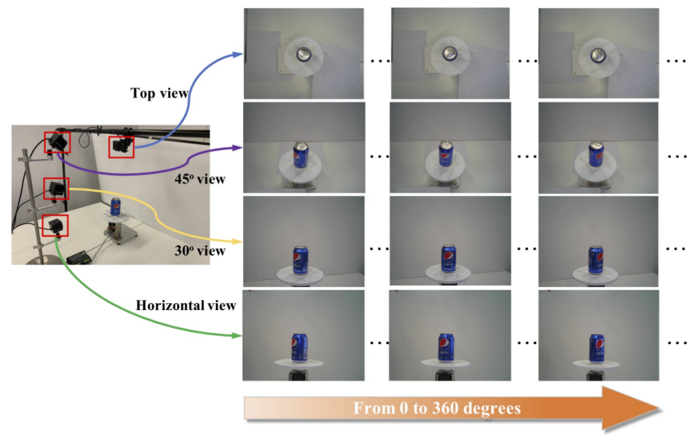
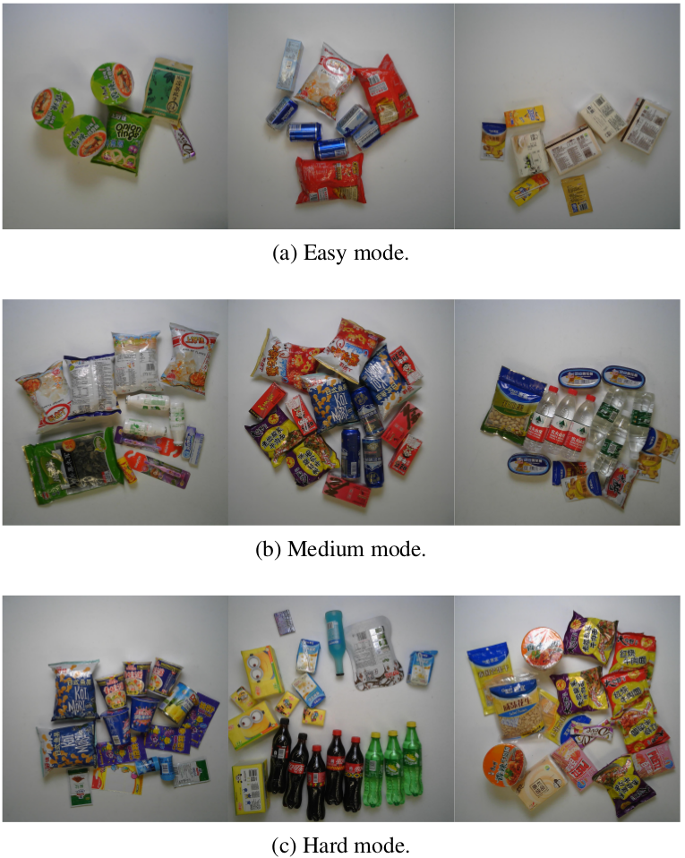
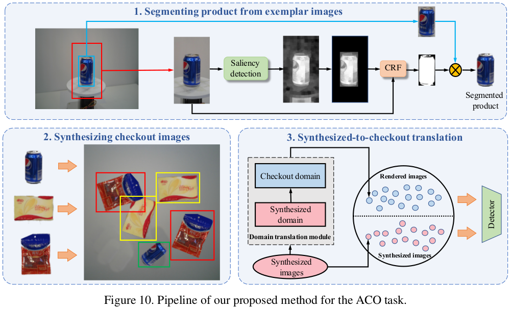
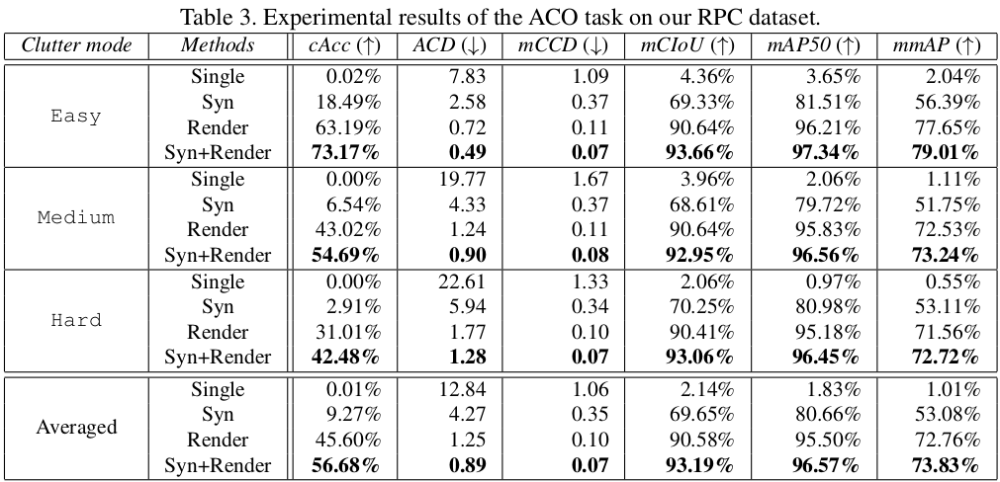

# RPC: A Large-Scale Retail Product Checkout Dataset

 ### [Abstract](#1-abstract) | [Paper](#2-paper) | [Dataset](#3-Dataset) | [Baselines](#4-baselines-on-rpc-dataset) | [Leaderboard](#5-Leaderboard) 

## 1. Abstract
Over recent years, emerging interest has occurred in integrating computer vision technology into the retail industry. Automatic checkout (ACO) is one of the critical problems in this area which aims to automatically generate the shopping list from the images of the products to purchase. The main challenge of this problem comes from the large scale and the fine-grained nature of the product categories as well as the difficulty for collecting training images that reflect the realistic checkout scenarios due to continuous update of the products. Despite its significant practical and research value, this problem is not extensively studied in the computer vision community, largely due to the lack of a high-quality dataset. To fill this gap, in this work we propose a new dataset to facilitate relevant research. Our dataset enjoys the following characteristics: (1) It is by far the largest dataset in terms of both product image quantity and product categories. (2) It includes single-product images taken in a controlled environment and multi-product images taken by the checkout system. (3) It provides different levels of annotations for the checkout images. Comparing with the existing datasets, ours is closer to the realistic setting and can derive a variety of research problems. Besides the dataset, we also benchmark the performance on this dataset with various approaches.

## 2. Paper

   

[Paper on arXiv => "RPC: A Large-Scale Retail Product Checkout Dataset"]()

## 3. Dataset 

     
[Dataset on Kaggle => "Retail Product Checkout Dataset"](https://www.kaggle.com/diyer22/retail-product-checkout-dataset)
(15 GB)

#### 3.1 Dataset License:  
    
CC BY-NC-SA 4.0

#### 3.2 Dataset infomation 

| name | image_num | bbox_num | bbox_per_image | class_per_image |
| --- | --- | --- | --- | --- |
| train(single) | 53739 | 53739 | 1 | 1 |
| val | 6000 | 73658 | 12.28 | 6.34 |
| test | 24000 | 294315 | 12.26 | 6.31 |

#### 3.3 Collection equipment for single product images (train set)

#### 3.4 Different clutter levels for checkout images  (test/val set)

#### 3.5 Each clutter level's number on test and val set

| name | image_num | bbox_num | bbox_per_image | class_per_image |
| --- | --- | --- | --- | --- |
| easy | 10000 | 71519 | 7.15 | 3.81 |
| medium | 10000 | 122980 | 12.3 | 6.27 |
| hard | 10000 | 173474 | 17.35 | 8.87 |

## 4. Baselines on RPC dataset

#### 4.1 Pipeline of Syn+Render Method

#### 4.2 Experimental Results

## 5. Leaderboard
[RPC-Leaderboard](https://github.com/RPC-Dataset/RPC-Leaderboard)

