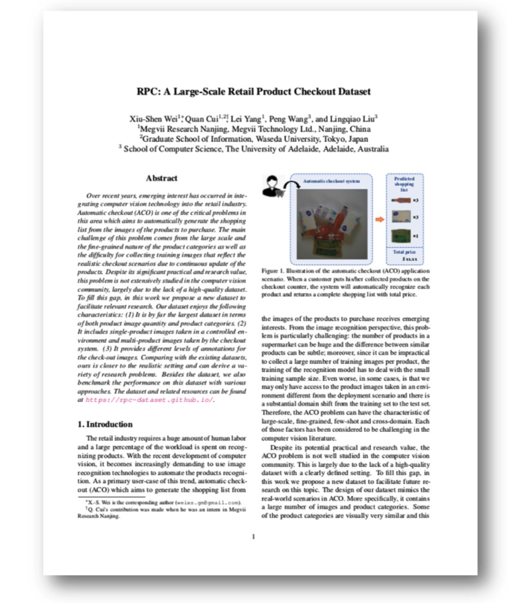

<head>
    <meta charset="UTF-8">
    <title>RPC-Dataset Project Page</title>
    <meta name="description" content="A Large-Scale Retail Product Checkout Dataset">
    <meta name="keywords" content="rpc dataset, rpctool, retail, product detection">
    <link rel="shortcut icon" href="./favicon.ico">
</head>

# RPC: A Large-Scale Retail Product Checkout Dataset

**[Xiu-Shen Wei1*](http://www.weixiushen.com/) &nbsp;&nbsp;&nbsp; Quan Cui1,2 &nbsp;&nbsp;&nbsp; [Lei Yang1](https://github.com/DIYer22)&nbsp;&nbsp;&nbsp; Peng Wang3 &nbsp;&nbsp;&nbsp; Lingqiao Liu3**

1Megvii Research Nanjing, Megvii Technology Ltd., Nanjing, China    
2Graduate School of IPS, Waseda University, Fukuoka, Japan    
3School of Computer Science, The University of Adelaide, Adelaide, Australia

---

 ### [Abstract](#1-abstract) | [Paper](#2-paper) | [Dataset](#3-our-rpc-dataset) | [Baselines](#4-proposed-baseline-method-on-the-rpc-dataset) | [Leaderboard](#5-Leaderboard) | [RPC-tool](#6-rpc-tool) 

## 1. Abstract

<em>&nbsp;&nbsp;&nbsp;&nbsp;&nbsp;Over recent years, emerging interest has occurred in integrating computer vision technology into the retail industry. Automatic checkout (ACO) is one of the critical problems in this area which aims to automatically generate the shopping list from the images of the products to purchase. The main challenge of this problem comes from the large scale and the fine-grained nature of the product categories as well as the difficulty for collecting training images that reflect the realistic checkout scenarios due to continuous update of the products. Despite its significant practical and research value, this problem is not extensively studied in the computer vision community, largely due to the lack of a high-quality dataset. To fill this gap, in this work we propose a new dataset to facilitate relevant research. Our dataset enjoys the following characteristics: (1) It is by far the largest dataset in terms of both product image quantity and product categories. (2) It includes single-product images taken in a controlled environment and multi-product images taken by the checkout system. (3) It provides different levels of annotations for the checkout images. Comparing with the existing datasets, ours is closer to the realistic setting and can derive a variety of research problems. Besides the dataset, we also benchmark the performance on this dataset with various approaches.</em>

## 2. Paper

   

[**Paper on arXiv => "RPC: A Large-Scale Retail Product Checkout Dataset"**](https://arxiv.org/abs/1901.07249)

## 3. Our RPC dataset 

     

[**Dataset on Kaggle => "The Retail Product Checkout dataset"**](https://www.kaggle.com/diyer22/retail-product-checkout-dataset)
(15 GB)

\***Notice**: If downloading from Kaggle is not accessable, you can alternatively download the dataset using [Baidu Drive](https://pan.baidu.com/s/1vrrLaSpJe5JxT3zhYfOaog).

#### 3.1 Dataset license:  
    
CC BY-NC-SA 4.0

#### 3.2 Overview infomation of the RPC dataset 

| *Split* | *# images* | *# objects* | *# objects/image* | *# categories/image* |
| --- | ---: | ---: | ---: | ---: |
| Training set (Exemplar images) | 53,739 | 53,739 | 1 | 1 |
| Validation set (Checkout images) | 6,000 |   73,602 | 12.27 | 6.33 |
| Test set (Checkout images)| 24,000 |  294,333 | 12.26 | 6.31 |

#### 3.3 Collection equipment for single product images (training set)

   

 

#### 3.4 Different clutter levels for checkout images (val/test sets)

   

#### 3.5 Detailed information of val+test sets for different clutters

| *Clutter mode* | *# images* | *# objects* | *# objects/image* | *# categories/image* |
| --- | ---: | ---: | ---: | ---: |
|       Easy |  10,000 |   71,496 |                    7.15 |                      3.81 |
|     Medium |  10,000 |  122,961 |                   12.30 |                      6.27 |
|       Hard |  10,000 |  173,478 |                   17.35 |                      8.87 |

## 4. Proposed baseline method on the RPC dataset

#### 4.1 Pipeline of our *Syn+Render* method

    

#### 4.2 Experimental results

    

## 5. Leaderboard

[**RPC-Leaderboard**](https://github.com/RPC-Dataset/RPC-Leaderboard)

If you have been successful in creating a model based on the training set and it performs well on the validation set, we encourage you to run your model on the test set. The  [`rpctool`](https://github.com/DIYer22/retail_product_checkout_tools) (in the next section in this project page) will contribute to return the corresponding results of the evaluation metrics. You can submit your results on the RPC leaderboard by creating a new issue. Your results will be ranked in the leaderboard and to benchmark your approach against that of other machine learners. We are looking forward to your submission. Please click [here](https://github.com/RPC-Dataset/RPC-Leaderboard/issues) to submit.

## 6. RPC-tool

[`rpctool`](https://github.com/DIYer22/retail_product_checkout_tools): A Python package for evaluating your methods on the RPC dataset. It can return several evaluation metrics (listed in the aforementioned table in Sec. 4.2). More information can be found in [`rpctool`](https://github.com/DIYer22/retail_product_checkout_tools).

## 7. ATTN

This dataset and code packages are free for academic usage. You can run them at your own risk. For other purposes, please contact the corresponding author Dr. Xiu-Shen Wei (weixs.gm [at] gmail.com).

<!-- Global site tag (gtag.js) - Google Analytics -->

